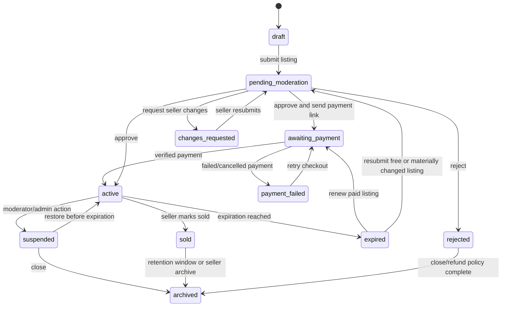

# Listing Lifecycle

## Canonical states

The implementation uses the status values below. Earlier terms
`pending_moderation` and `active` in this document map respectively to
`in_review` and `published`; browser routes and services must use the actual
values.

```text
draft
awaiting_payment
payment_failed
pending_moderation
changes_requested
active
rejected
suspended
sold
expired
archived
```

`archived` is terminal for ordinary users. Administrative restoration must be an explicit audited service, not a direct status edit.

## Primary flow



## Transition ownership

| Transition | Allowed actor/system |
|---|---|
| draft → pending_moderation | seller through submit service |
| pending_moderation → awaiting_payment | authorized moderator approves payment link |
| awaiting_payment → active | verified payment handler only |
| pending_moderation → active/changes_requested/rejected | authorized moderator |
| changes_requested → pending_moderation | listing owner after validation |
| active → sold | listing owner or authorized staff |
| active → expired | scheduled system command |
| active → suspended | authorized moderator/admin |
| suspended → active | senior moderator/admin after policy checks |
| any non-terminal → archived | explicit owner/staff service according to policy |

Never allow public form input to assign a status directly.

## Submission completeness

A listing may leave `draft` only when:

- seller account is active
- required phone verification is current
- category is active and supports the listing kind
- state/county/city are valid
- all common required fields are valid
- compatible detail model is complete
- required image minimum is met for that listing kind
- product and price are determined
- prohibited obvious content checks pass
- seller accepts current terms/policy version

The universal “three photos and price” rule must be configurable by listing kind because wanted listings, community events, free items, or other approved exceptions may differ.

## Payment boundary

Paid listings are not requested from the seller before moderation. Only a
verified provider event can mark a moderator-approved payment-pending order paid
and transition the listing to `active`.

The success page may poll/read order state and display “payment processing” until the webhook is complete.

## Moderation behavior

Approval sets `published_at` and calculates `expires_at` from the purchased product unless an already-approved renewal policy applies.

Rejection and change requests require controlled reason codes and seller-visible explanations. Internal notes must never leak into seller-facing templates or APIs.

## Material edits

Provisional Phase 1A rule:

- Typographical edits to non-sensitive display text may be eligible for a limited moderator/admin path.
- Seller changes to title, description, price, category, location, photos, or vertical detail fields are material.
- A material edit to an active listing returns it to `pending_moderation` and removes it from public results until approved.
- Every edit creates status/audit history.

A future listing-revision model can keep the last approved version public while a proposed revision is reviewed. Do not implement that complexity unless product accepts it as a requirement.

## Expiration

A scheduled command selects active listings whose `expires_at <= now`, locks them in batches, transitions them to `expired`, records history, and emits notification events. The command is idempotent and safe to rerun.

Suggested reminder events are configurable, for example before expiration and shortly after expiration. Exact timing is a product decision.

## Renewal

Renewal creates a new order and does not alter the prior financial record.

Provisional policy:

- unchanged listing renewed within an approved grace period may return to active after payment without full moderation
- material changes or long-expired listings return to moderation
- extension begins from the later of current expiration or payment completion, according to a documented product rule
- a failed renewal never changes the existing publication entitlement

## Sold and archive

“Sold” is a user-declared close reason, not proof of a completed transaction. It must not unlock ratings until an interaction-eligibility system exists.

Sold listings remain visible with a Sold badge on the seller's public profile for 30 days. They are excluded from global browse and search throughout that period. After it ends they are no longer publicly listed; archived listings remain available only to the owner and staff according to retention policy.

## Suspension

Suspension requires a reason, actor, timestamp, seller-visible message where appropriate, and staff audit. Suspending an account must trigger a defined policy for all active listings; do not update them with an unbounded loop inside the request.
